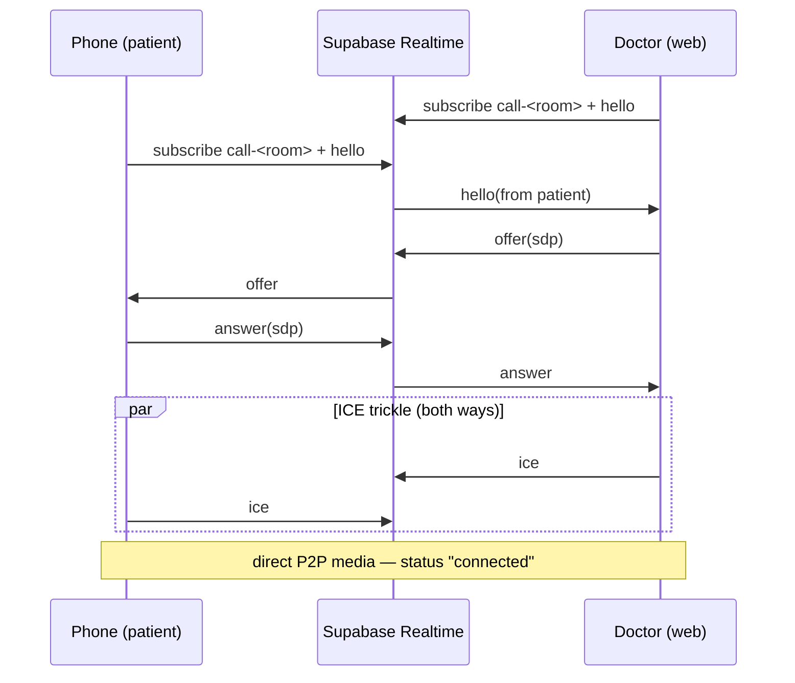
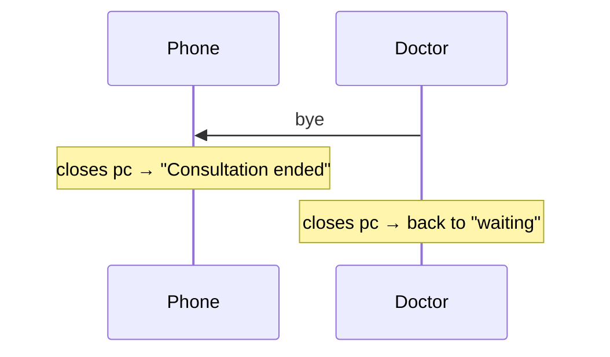

# Handover — connecting the phone to the web video call (Supabase signalling)

**Audience:** whoever implements the call on the **Expo patient app**.
**Goal:** a patient on a phone and a doctor on the web portal end up in the same
1:1 WebRTC call, with **no media server** in between — Supabase Realtime is used
only to exchange the connection handshake.

> Reference implementations already in this repo:
> - Web (doctor + browser patient): [`src/lib/webrtc/use-call.ts`](../src/lib/webrtc/use-call.ts)
> - Phone (React Native twin): [`patient-app-reference/lib/useNativeCall.ts`](../patient-app-reference/lib/useNativeCall.ts)
>
> If you implement to the contract below, the phone will interoperate with the
> **already-deployed** web side without any change to the web.

---

## 1. The model in one line

Both peers join a Supabase Realtime **broadcast channel named after the
consultation**, trade SDP/ICE over it, then stream **peer-to-peer**.

```
Expo patient app                                   Doctor web portal
  useNativeCall(room)                                useCall(room,"doctor")
        │                                                     │
        └──── Supabase Realtime broadcast:  call-<room> ───────┘
                 (hello / offer / answer / ice / bye)
        │                                                     │
        └────────────── direct WebRTC media ───────────────────┘
                     (STUN, relayed via TURN when needed)
```

Supabase carries **signalling only**. Audio/video never touches it.

---

## 2. Connection contract (normative)

Implement exactly this and you will connect.

### 2.1 The room id

`room` = **`QueueEntry.id`** — the consultation row both sides already share.

- The doctor's consult page passes `room={item.id}`.
- The phone gets the same id from the request it created (see §5).
- The browser fallback for patients is `/call/<room>`.

### 2.2 The channel

```ts
const channel = supabase.channel(`call-${room}`, {
  config: { broadcast: { self: false } },   // don't echo your own messages
});
channel.on("broadcast", { event: "signal" }, ({ payload }) => onSignal(payload));
channel.subscribe((status) => {
  if (status === "SUBSCRIBED") send({ kind: "hello", from: role });
});
```

| Item | Value |
|---|---|
| Channel name | `` `call-${room}` `` |
| Event name | `signal` |
| `broadcast.self` | `false` |
| Send shape | `channel.send({ type: "broadcast", event: "signal", payload })` |

### 2.3 Message schema

```ts
type CallRole = "doctor" | "patient";

interface Signal {
  kind: "hello" | "offer" | "answer" | "ice" | "bye";
  from: CallRole;                    // always your own role
  sdp?: RTCSessionDescriptionInit;   // offer | answer
  candidate?: RTCIceCandidateInit;   // ice
}
```

**Always ignore messages where `payload.from === yourRole`** (belt-and-braces
alongside `self: false`).

### 2.4 Roles — who does what

| Role | Responsibility |
|---|---|
| `doctor` | **Offerer.** Creates the offer, handles the answer. |
| `patient` | **Answerer.** Never offers; answers offers. ← *the phone* |

The phone is **always `patient`**.

### 2.5 Required behaviour per message

| Received | `doctor` does | `patient` (phone) does |
|---|---|---|
| `hello` | If not already `connected` → create & send a new **offer** | If currently `waiting` → send `hello` back (wakes a late doctor) |
| `offer` | *(ignore)* | New `RTCPeerConnection` → `setRemoteDescription` → **flush buffered ICE** → `createAnswer` → `setLocalDescription` → send `answer` |
| `answer` | `setRemoteDescription` → flush buffered ICE | *(ignore)* |
| `ice` | If `remoteDescription` is set → `addIceCandidate`; **else buffer it** | same |
| `bye` | Close pc, drop remote stream, return to `waiting` | Close pc, show "consultation ended" |

The mutual `hello` is what makes **join order irrelevant** and what makes a
**page reload renegotiate** automatically: whoever (re)joins announces, the
doctor re-offers against a fresh peer connection.

> **The ICE buffer is not optional.** Candidates routinely arrive before the
> remote description is set; dropping them causes calls that "connect" but never
> show video. Queue them and flush after `setRemoteDescription`.

### 2.6 ICE servers

```ts
{
  iceServers: [
    { urls: ["stun:stun.l.google.com:19302", "stun:stun1.l.google.com:19302"] },
    // TURN — REQUIRED in practice for phones on mobile data
    { urls: [<TURN_URLS>], username: <TURN_USERNAME>, credential: <TURN_CREDENTIAL> },
  ]
}
```

⚠️ **STUN alone will fail for a large share of real users.** Indian carrier
networks sit behind carrier-grade NAT, so a direct path often can't be found and
the call silently never connects. **Both peers must point at the same TURN
server.**

| Side | Env vars |
|---|---|
| Web (Vercel) | `NEXT_PUBLIC_TURN_URLS`, `NEXT_PUBLIC_TURN_USERNAME`, `NEXT_PUBLIC_TURN_CREDENTIAL` |
| Expo | `EXPO_PUBLIC_TURN_URLS`, `EXPO_PUBLIC_TURN_USERNAME`, `EXPO_PUBLIC_TURN_CREDENTIAL` |

Get one from **metered.ca** (free tier ≈50 GB/mo) or self-host **coturn**.
The code already reads these; they are currently **unset**, so today the call is
STUN-only.

---

## 3. Call flow

### Normal call (doctor already waiting)



### Hang up



### Status model (mirror it for consistent UI)

`idle → waiting → connecting → connected → ended`, plus `media-error`
when camera/mic permission is denied.

---

## 4. Auth & permissions

- **Media capture must follow a user gesture** (a "Join" button). Calling
  `getUserMedia` on mount is blocked and shows as `media-error`.
- **Realtime broadcast** currently needs only the anon key — it is *not*
  RLS-gated (see §7 hardening). Postgres-changes subscriptions **do** need the
  JWT: call `supabase.realtime.setAuth(session.access_token)` before subscribing,
  or RLS silently drops every event.
- Room ids are unguessable cuids, which is the only thing gating the channel today.

---

## 5. Where the phone gets the room id (full lifecycle)

The call is the last step of the on-demand flow that is **already live**:

1. After ARIA intake the app inserts a consult request → **`requestConsult()`**
   returns the `queueId`
   ([`patient-app-reference/lib/enqueue.ts`](../patient-app-reference/lib/enqueue.ts)).
2. The app watches that row → **`useIncomingPickup(queueId)`**
   ([…/useIncomingPickup.ts](../patient-app-reference/lib/useIncomingPickup.ts)).
3. An on-call doctor taps **Accept** → the row atomically flips to
   `state = in_consult` with `doctorId` set.
4. The hook reports `"picked-up"` → navigate to the call screen with
   **`room = queueId`**.
5. Both sides are now in `call-<queueId>` → §2 handshake runs → connected.

```tsx
const queueId = await requestConsult(patientId, aria, "video");
const pickup  = useIncomingPickup(queueId);
useEffect(() => { if (pickup === "picked-up") router.push(`/call/${queueId}`); }, [pickup]);
// call screen:
<CallScreen room={queueId} />
```

---

## 6. Implementing on the phone

```bash
npx expo install react-native-webrtc @config-plugins/react-native-webrtc \
  @supabase/supabase-js @react-native-async-storage/async-storage react-native-url-polyfill
```

`app.json`:
```json
{ "expo": { "plugins": ["@config-plugins/react-native-webrtc"] } }
```

> ⚠️ **`react-native-webrtc` contains native code — it does NOT run in Expo Go.**
> You need a dev build: `npx expo prebuild && npx eas build --profile development`.

API differences from the browser (already handled in the RN reference):

| Browser | React Native |
|---|---|
| `navigator.mediaDevices.getUserMedia` | `mediaDevices.getUserMedia` from `react-native-webrtc` |
| `pc.onicecandidate = …` | `pc.addEventListener("icecandidate", …)` |
| `<video srcObject>` | `<RTCView streamURL={stream.toURL()} />` |
| plain candidate object | wrap: `new RTCIceCandidate(payload.candidate)` |
| plain sdp object | wrap: `new RTCSessionDescription(payload.sdp)` |

**Mute must flip the track, not just the UI:**
```ts
stream.getAudioTracks().forEach(t => (t.enabled = !muted));  // real mute
stream.getVideoTracks().forEach(t => (t.enabled = camOn));   // real camera off
```

Drop-in files to copy: [`useNativeCall.ts`](../patient-app-reference/lib/useNativeCall.ts)
and [`CallScreen.tsx`](../patient-app-reference/screens/CallScreen.tsx).

---

## 7. Verifying it works

**Against the deployed web side** — no local setup needed:
1. Sign in to the portal, open a consult, press **Connect**.
2. On the phone, join the same `room` (the `queueId`).
3. Expect: both show **LIVE**, video both ways, mute/camera visibly affect the
   other side, End propagates.

**Automated (the pattern used for the web pair)** — Playwright with
`--use-fake-device-for-media-stream --use-fake-ui-for-media-stream`, two
contexts, then assert `video[data-remote].videoWidth > 0` on **both** sides.
Checking `connectionState === "connected"` is not enough — it can be connected
with zero frames flowing.

**TURN check:** force `iceTransportPolicy: "relay"` in a test build; if the call
still connects, TURN is genuinely working.

---

## 8. Gotchas & hardening

| Gotcha | Consequence |
|---|---|
| No TURN configured (today's state) | Calls fail on mobile data / CGNAT — **the top priority to fix** |
| Expo Go | `react-native-webrtc` won't load at all; needs a dev build |
| Not buffering early ICE | Connects but no media |
| `getUserMedia` without a gesture | Permission blocked → `media-error` |
| Forgetting `self: false` | You process your own offers and deadlock |
| Muting in UI state only | The other side still hears you — a privacy bug |

**Before production:** the `call-<room>` broadcast channel is currently open to
anyone who knows the room id. Add Realtime **channel authorization** (RLS on
`realtime.messages`) so only the assigned patient and the claiming doctor can
join that room.
